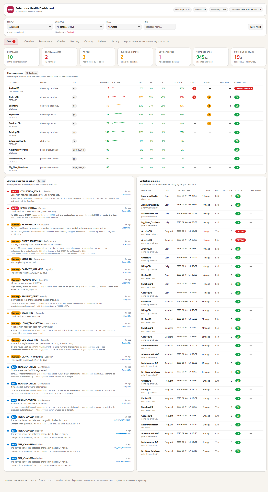
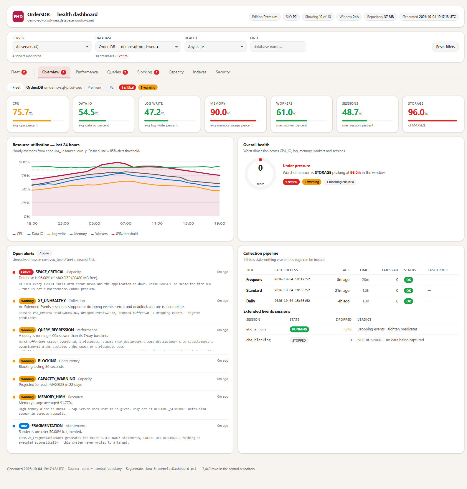
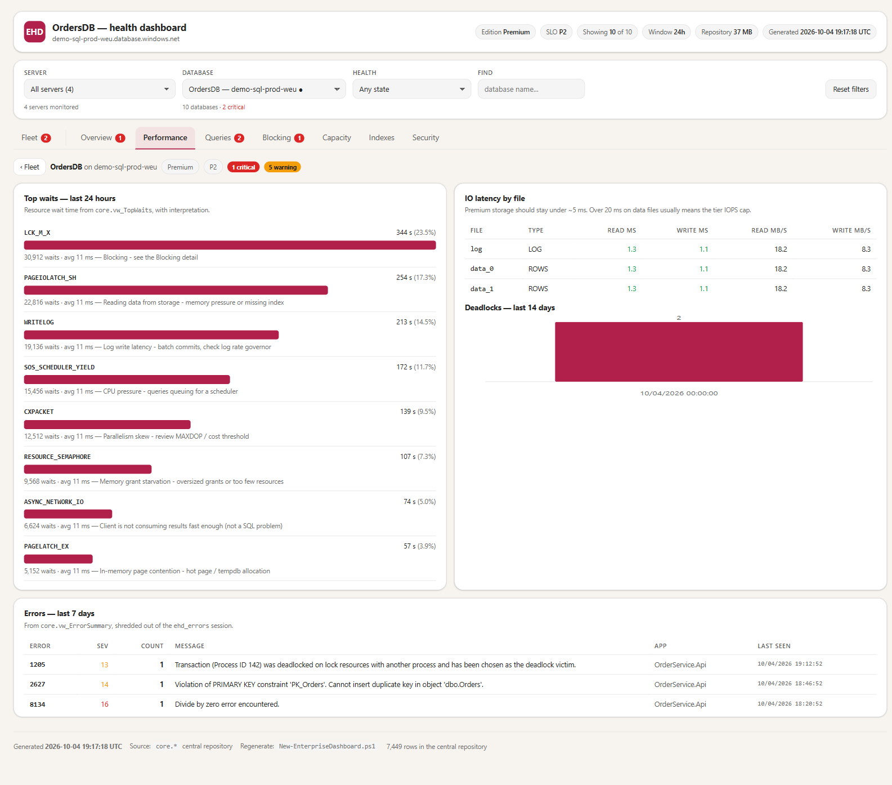
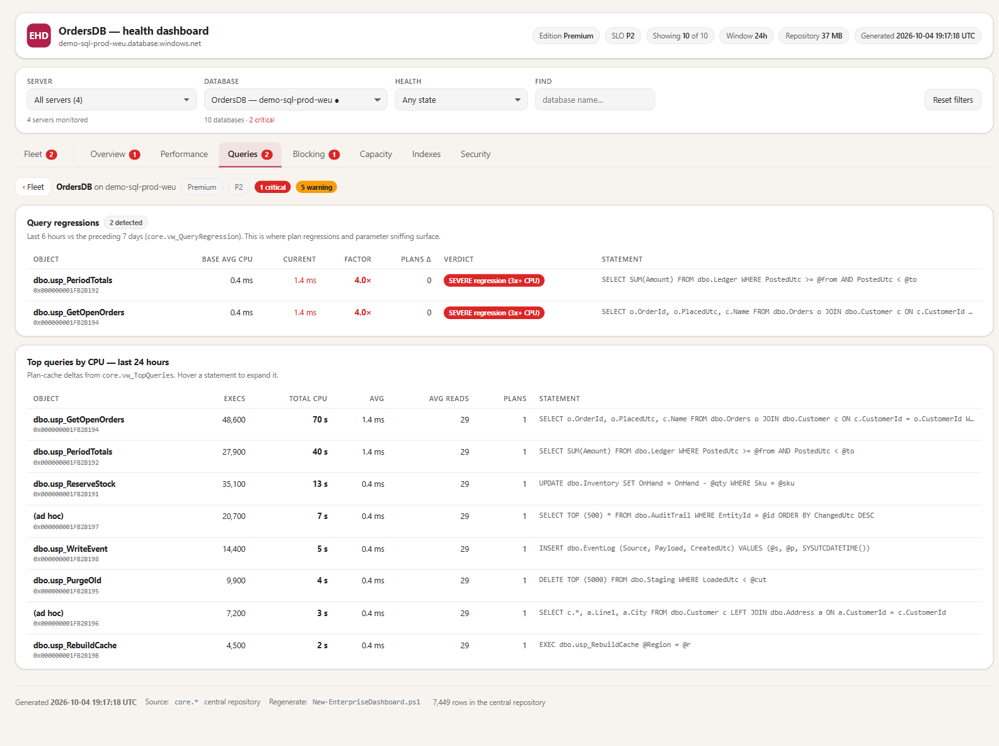
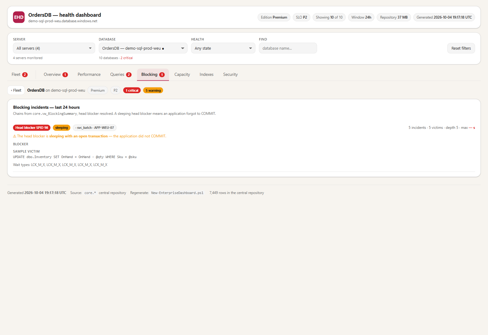
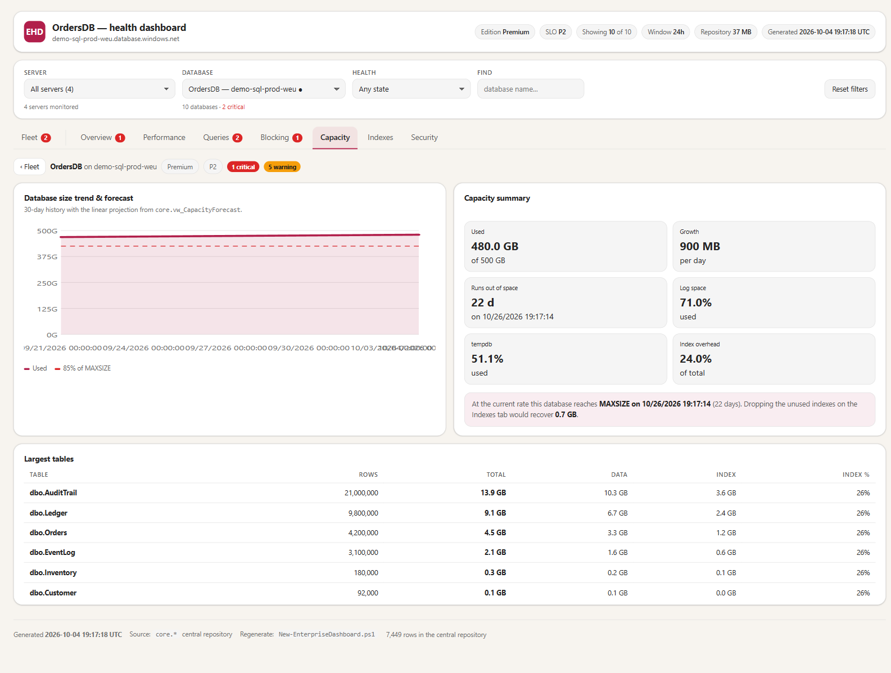
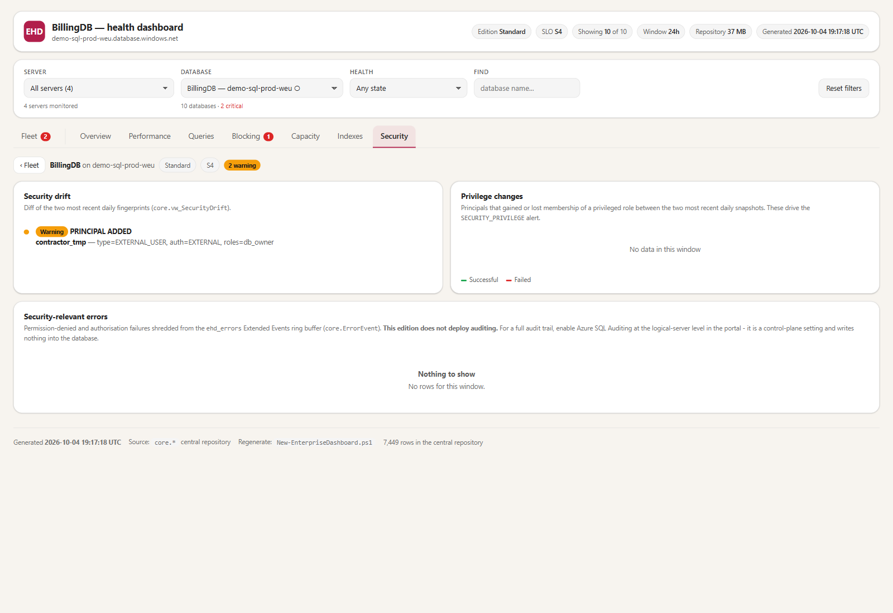

# Enterprise Health Dashboard

**Zero-footprint monitoring for Azure SQL Database.** Nothing is deployed into the databases you monitor — no tables, no procedures, no agents, no data access. A central repository reaches out on a schedule, reads dynamic management views, and renders a single self-contained HTML file.



---

## Why this exists

Most SQL monitoring assumes you own the database. Often you don't. It belongs to a vendor, or it's under change control, or it carries compliance obligations that make deploying objects into it expensive, slow, or simply not permitted.

This system monitors those databases without touching them.

| | In a monitored database | In the central repository |
|---|---|---|
| Tables / views / procedures | **none** | 27 / 22 / 9 |
| Database principal | **none**, with server-level roles | one managed-identity user |
| Extended Events sessions | optional, opt-in, disabled by default | — |
| Permissions needed | read-only DMV access | full control — you own it |
| Data read | **DMVs only, never table contents** | — |

Authentication is a **user-assigned managed identity** throughout. There are no passwords, connection strings or credentials anywhere in the system.

---

## How it works

```
  ┌─────────────────────┐
  │ Elastic Job Agent   │   three schedules: 5 min · 30 min · daily
  └──────────┬──────────┘
             │  read-only T-SQL, executed INSIDE each target
             ▼
  ┌─────────────────────────────────────────────┐
  │  monitored databases (vendor-owned, etc.)   │   nothing is created here
  └──────────┬──────────────────────────────────┘
             │  Elastic Jobs lands each result set
             ▼
  ┌─────────────────────┐
  │  stg.*   landing    │   created BY THE AGENT, never by you
  │  core.*  modelled   │   usp_Normalize promotes and de-duplicates
  │  cfg.*   config     │   34 tunable settings
  └──────────┬──────────┘
             │  ONE connection, one batch
             ▼
  ┌─────────────────────┐
  │  dashboard.html     │   self-contained, no server, no dependencies
  └─────────────────────┘
```

The job agent's own job database **is** the repository. That is supported — a job database is an ordinary Azure SQL Database and can host other schemas — and it is what lets the alert engine explain *why* a feed went stale, because `jobs.job_executions` becomes a local join rather than a cross-database hop.

---

## What you get

<table>
<tr>
<td width="50%"></td>
<td width="50%"></td>
</tr>
<tr>
<td><b>Per-database overview</b> — resource gauges, 24 h trend, open alerts, and the collection pipeline that tells you whether to trust any of it.</td>
<td><b>Waits with interpretation</b> — not just <code>PAGEIOLATCH_SH</code>, but what it means and what to do about it.</td>
</tr>
<tr>
<td></td>
<td></td>
</tr>
<tr>
<td><b>Query regressions</b> — same query, more CPU per execution. Distinguishes a plan regression from a load increase.</td>
<td><b>Blocking chains</b> — head blocker resolved. A <i>sleeping</i> head blocker means an application forgot to <code>COMMIT</code>.</td>
</tr>
<tr>
<td></td>
<td></td>
</tr>
<tr>
<td><b>Capacity forecast</b> — linear projection to <code>MAXSIZE</code>, with what reclaiming unused indexes would buy you.</td>
<td><b>Security drift</b> — principals and permissions that changed between daily snapshots. No auditing required on the target.</td>
</tr>
</table>

Also: index usage and missing indexes, fragmentation as a prioritised work list, deadlock graphs, error events, IO latency per file, tempdb and log pressure, service-tier changes.

---

## Quick start

**Prerequisites:** an Azure SQL logical server you own, Azure CLI, and either SSMS or Python 3 with `pyodbc` + ODBC Driver 18.

```powershell
# 1. Repository schema — run against your central database, in filename order.
#    Filename order IS dependency order.
python deploy/Invoke-EhdSql.py -S <srv>.database.windows.net -d <db> -i 01-central/00-schemas-and-config.sql
python deploy/Invoke-EhdSql.py -S <srv>.database.windows.net -d <db> -i 01-central/01-core-tables.sql
# ... through 06-purge.sql

# 2. Create a user-assigned managed identity and an Elastic Job Agent against
#    that same database (portal, ARM REST, or New-AzSqlElasticJobAgent).
#    NOTE: `az sql elastic-job` does not exist in Azure CLI.

# 3. Grants + the privilege boundary, then the job definitions
python deploy/Invoke-EhdSql.py ... -i 03-elasticjobs/20-agent-setup.sql
python deploy/Invoke-EhdSql.py ... -i 03-elasticjobs/21-jobs-frequent.sql   # and 22..25
python deploy/Invoke-EhdSql.py ... -i 01-central/04-job-health.sql          # re-run

# 4. Register a target, run one job by hand, then verify the staging contract
python deploy/Invoke-EhdSql.py ... -i tests/verify-staging-schema.sql

# 5. Render
./04-dashboard/New-EnterpriseDashboard.ps1 `
    -CentralServer <srv>.database.windows.net -CentralDatabase <db> `
    -OutputPath ./estate.html
```

Full procedure with a verification gate at every step: **[DEPLOY-AND-OPERATE.md](DEPLOY-AND-OPERATE.md)**.

### Try it without an estate

```powershell
python deploy/Invoke-EhdSql.py ... -i tests/Seed-DemoEstate.sql   # 2 servers, 6 databases
python deploy/Invoke-EhdSql.py ... -Q "EXEC core.usp_EvaluateAlerts;"
./04-dashboard/New-EnterpriseDashboard.ps1 ... -OutputPath ./demo.html
python deploy/Invoke-EhdSql.py ... -i tests/Remove-DemoEstate.sql  # dry run by default
```

The demo estate covers every health state: critical, warning, healthy, and *not reporting*. The cleanup is a **dry run unless you set `@Commit = 1`**, discovers tables by looking for a `ServerName` column rather than a hard-coded list, and refuses to run if anything matching the demo prefix isn't marked as demo data.

---

## Layout

```
01-central/        repository schema — tables, views, normalizer, alert engine, retention
02-targets/        what a monitored database needs (usually: nothing)
03-elasticjobs/    agent setup, 6 jobs, 25 steps, 18 read-only collection commands
04-dashboard/      the HTML template and the PowerShell generator
deploy/            Invoke-EhdSql.py (token auth), orchestrator, doc generators
tests/             contract tests, staging verification, demo seed + cleanup
docs/              generated object reference, screenshots
```

`DEPLOY-AND-OPERATE.md` is the operational manual — 15 sections covering provisioning, gates, day-2 operations, incident runbooks, and a troubleshooting table of every failure mode hit in a real deployment.

---

## The guarantees, and how they're enforced

**Every embedded collection command is read-only.** Not by convention — by test. `tests/Test-EmbeddedCommands.ps1` extracts all 18 commands, parses each with ScriptDom, and fails on any `CREATE`/`ALTER`/`DROP`/`INSERT`/`UPDATE`/`DELETE`/`MERGE`/`SELECT INTO` against a permanent object.

```
18 embedded command(s) checked - all parse and all are read-only.
EXEMPT (write-capable by design): 25-jobs-setup.sql
```

The one exception is **reported, never silent** — an invisible exemption would erode the guarantee the test exists to provide. That job is created disabled and unscheduled.

**The collector cannot touch the job control plane.** The managed identity gets what it needs on `stg`/`core`/`cfg`, read access to `jobs` via the agent's own `jobs_reader` role, and an explicit DENY on every form of write to `jobs` and `jobs_internal`.

> Do not add `CONTROL` to that DENY. `CONTROL` implies every permission, so `DENY ... CONTROL` also denies `SELECT` — and `DENY` beats `GRANT` and beats role membership. The failure is specific and confusing: normalization keeps working, only alert evaluation dies, and it reads as an alerting bug.

**Deployments are verifiable.** `deploy/Invoke-EhdSql.py` records the SHA-256 of every file it executes into `cfg.DeployLog`; `tests/Test-Deployed.ps1` compares that against the files on disk and reports `OK` / `STALE` / `?`. The `?` means *"deployed some other way, so nobody can prove what is running"* — which is different from both of the others.

---

## Things that cost real time

Hard-won. All covered in full in `DEPLOY-AND-OPERATE.md` §12.

**Elastic Jobs adds exactly ONE column to an output table** — `internal_execution_id uniqueidentifier`. It does *not* add `target_server_name` or `target_database_name`; those belong to the `jobs.job_executions` **catalog view**, which is a different object entirely. Conflating the two is easy and expensive. Every collection query here therefore emits its own identity:

```sql
ServerName   = CAST(@@SERVERNAME AS nvarchar(256)),
DatabaseName = DB_NAME(),
SnapshotUtc  = ...
```

**A collect job whose target group is empty reports success — forever.** Every step logs "Step N succeeded", which is vacuously true: it completed, zero times. Check `target_database_name` on the execution rows; if it's NULL everywhere, the job ran against nothing.

**`BEGIN TRY` cannot catch a binding error.** `Invalid object name 'sys.dm_...'` is raised at compile time, before the `TRY` block is entered. Guard with `OBJECT_ID(...) IS NOT NULL` and defer the bind through `sp_executesql`.

**A failed step aborts the remaining steps in that job.** Four missing feeds usually means one broken step, not four. Diagnose in `step_id` order.

**SSMS does not reload a file changed on disk.** F5 runs the editor buffer. After any redeploy, verify what actually landed — `LEN(OBJECT_DEFINITION(...))`, or `cfg.DeployLog`.

**The agent needs network access to the repository's own server.** Even when the agent, its job database and the repository all sit on the same logical server, the agent connecting to it *as a target* still traverses the firewall or private-endpoint path.

---

## Design notes

**Five minutes, not one.** `sys.dm_db_resource_stats` holds 15-second samples for the trailing hour. Every run pulls the whole window, so a 5-minute schedule still yields 15-second granularity *and* a missed run loses nothing. A 1-minute schedule gives identical data at five times the connection cost. What genuinely suffers is blocking — covered by a continuously-running Extended Events session instead.

**Deltas are computed centrally.** Targets hold no state. Cumulative counters reset on failover, scale change and index rebuild; negative deltas are discarded rather than reported as enormous spikes.

**Collection health is evaluated before anything else.** A database that stopped reporting is not healthy — it is unknown, and the dashboard says so rather than showing a stale green.

**Alerts de-duplicate and auto-resolve.** One row stays open and updates while a condition persists, then closes itself when it clears. Count open rows, not history.

**Serverless databases cost money to monitor.** A 5-minute poll prevents auto-pause. A `GP_S_Gen5_1` that never pauses costs roughly $190/month against near-zero while paused. Decide that deliberately, per database.

---

## Validation

```powershell
./tests/Test-EmbeddedCommands.ps1    # read-only contract, 18 commands
./tests/Test-SettingKeys.ps1         # every key the code reads is defined, nothing dead
./tests/Test-Deployed.ps1 -CentralServer <srv> -CentralDatabase <db>
```

Current state: **T-SQL parse 0 errors across 20 files (~6,900 lines) · PowerShell 0 · 18/18 read-only + 1 declared exemption · settings 34/34.**

---

## Regenerating the object reference

The object documentation is generated from the scripts rather than written by hand, so it cannot drift:

```powershell
python deploy/Export-Inventory.py    # parses the scripts -> docs/inventory.json
node   deploy/doc3-objects.js        # -> Word document
```

---

## Status and scope

Built and proven against a live Azure SQL estate. This is a personal project, not a Microsoft product, and carries no support commitment. Read the code before running it against anything you care about — particularly `02-targets/10-target-permissions.sql`, the only place it asks for permissions on a database you may not own.

Issues and pull requests welcome.

## Licence

MIT. See [LICENSE](LICENSE).
